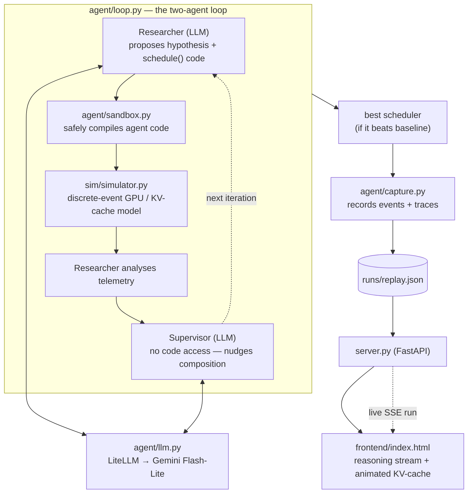

# Mini-Glia

<p align="center">
  
  
  
  
  
  
  
  <a href="https://mini-glia.dtlabs.me"></a>
</p>

<p align="center">
  <b>A miniature, honest reproduction of the two-agent architecture from
  <a href="https://arxiv.org/abs/2510.27176">Glia (arXiv:2510.27176)</a> —
  an AI that discovers systems algorithms by reasoning, not brute force.</b>
</p>

<p align="center">
  A <b>Researcher</b> agent and a <b>Supervisor</b> agent collaborate to design a
  batch scheduler for an LLM-inference GPU cluster, discovering the paper's
  central insight — reserve KV-cache headroom to prevent request evictions —
  through hypothesis, experiment, and analysis.
</p>

---

## What this is (and isn't)

This is a **faithful reproduction of the Glia paper's _method_**, built to understand
and demonstrate the two-agent reasoning loop — not a reimplementation of the full
system. Specifically:

- The **two-agent architecture is faithful**: a Researcher that proposes, codes,
  experiments, and analyses; a Supervisor that asks questions and nudges idea
  composition but never sees the code — exactly as described in §4 of the paper.
- The **discovered insight is real**: the agent independently finds that
  packing GPUs to capacity triggers KV-cache evictions, and that reserving
  _headroom_ for unknown decode growth fixes it — the paper's Head-Room Allocator.
- The **simulator is a faithful toy**: it models the mechanism that matters
  (incremental KV-cache allocation, out-of-memory eviction of the youngest
  request, lost progress on restart — the vLLM behaviour from the paper) in pure
  Python. The **numbers are illustrative**, tuned so the insight is discoverable;
  they are _not_ the paper's numbers (the paper uses `vidur`, a physically detailed
  simulator) and no GPU or real inference is involved.

In short: the _reasoning_ and the _mechanism_ are genuine; the _scale_ is a toy.
This is stated openly in the UI and here because honesty about scope is the point.

---

## Live demo

**→ [mini-glia.dtlabs.me](https://mini-glia.dtlabs.me)**

The dashboard loads a captured run — press **Play saved run** to watch the agent
step through its reasoning and the KV-cache animation, or **Watch it reason live**
to run the two agents unscripted against Gemini right now. Live search is
stochastic: some runs discover a strong scheduler, others explore dead ends and
reason their way back — the reasoning is the point, not a guaranteed win.

## Architecture



**The loop, in one sentence:** the Researcher proposes a scheduler → the sandbox
safely compiles it → the simulator evaluates it and returns telemetry → the
Researcher analyses → the Supervisor nudges → repeat, keeping the best design that
beats the baseline.

---

## The discovery

Starting from a naive first-come-first-served scheduler that packs each GPU full,
the agent typically walks this arc:

1. **Diagnoses memory pressure** — high restart fraction + low completion means
   GPUs are being oversubscribed and the youngest requests are evicted mid-decode.
2. **Reserves headroom** — admits requests only while a GPU keeps a memory safety
   margin free, so unknown decode growth stops triggering evictions.
3. **Tunes via a parameter sweep** — the agent requests a sweep over the headroom
   value and reads the results to pick the best (the paper's parameter search).
4. **Composes** — layers request ordering on top of the memory fix, often prompted
   by the Supervisor.

The result is an interpretable scheduler — a handful of readable lines — that
substantially cuts mean latency and restarts versus the baseline. The exact run
is captured and replayed in the dashboard, with the full discovered code shown.

---

## Running it

### Locally

```bash
cd backend
pip install -r requirements.txt

# the replay plays with no API key; the "watch it reason live" button needs one
export GEMINI_API_KEY=your_key
uvicorn server:app --reload --port 8000
```

Open <http://localhost:8000>. The dashboard auto-loads the captured run; press
**Play saved run** to watch it, or **Watch it reason live** to run the agent
unscripted against Gemini right now.

### Capturing a new run

```bash
cd backend
GEMINI_API_KEY=your_key MODEL=gemini/gemini-3.1-flash-lite \
  python -m agent.capture --out runs/replay.json
```

Live search is stochastic — some runs discover a strong scheduler, others explore
dead ends. `capture.py` refuses to save a run that doesn't beat baseline, so
re-run until it writes one you like.

### Docker

```bash
docker compose -f docker-compose.prod.yml up -d --build
```

The image serves the whole app on port 8000 (mapped to 8010 in compose). Set
`GEMINI_API_KEY` in a `.env` file next to the compose file for the live button.
A `mem_limit` is set to keep the live path from starving a co-hosted app.

---

## Layout

```
mini-glia/
├── backend/
│   ├── server.py              FastAPI: serves UI + /api/replay + /api/run (SSE)
│   ├── agent/
│   │   ├── loop.py            the Researcher + Supervisor orchestration
│   │   ├── llm.py             LiteLLM wrapper (Gemini / Ollama / mock), retries
│   │   ├── sandbox.py         safely compiles + runs agent-written schedulers
│   │   └── capture.py         runs one loop, records events + traces to JSON
│   ├── sim/
│   │   ├── simulator.py       discrete-event LLM-inference / KV-cache simulator
│   │   └── schedulers.py      reference schedulers + validation harness
│   └── runs/replay.json       a captured run the dashboard plays back
├── frontend/
│   └── index.html             single-file React dashboard (CDN, no build step)
├── Dockerfile
├── docker-compose.prod.yml
└── .github/workflows/ci.yml   lint · offline tests · docker build · deploy
```

---

## Testing

The offline tests run the **entire agent loop with a mock model** — no API key,
fully deterministic — plus the simulator's validation harness:

```bash
cd backend
PYTHONPATH=. MODEL=mock python agent/test_loop_offline.py   # end-to-end plumbing
PYTHONPATH=. python sim/schedulers.py                       # sim rewards the arc
```

The validation harness (`sim/schedulers.py`) is the guard that infrastructure
changes never silently corrupt the science: it fails (non-zero exit) if the
simulator stops rewarding the headroom insight, and it runs in CI on every push.

---

## Credits

Reproduction of the architecture from _Glia: A Human-Inspired AI for Automated
Systems Design and Optimization_ (Hamadanian, Karimi, Nasr-Esfahany, Noorbakhsh,
Chandler, ParandehGheibi, Alizadeh, Balakrishnan — MIT CSAIL,
[arXiv:2510.27176](https://arxiv.org/abs/2510.27176)). Built as a learning
exercise and demonstration; all simplifications are mine.
